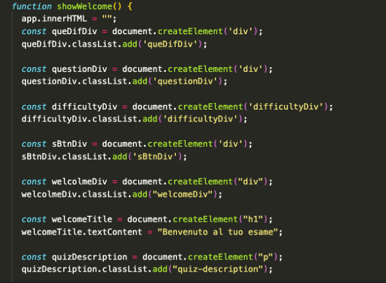
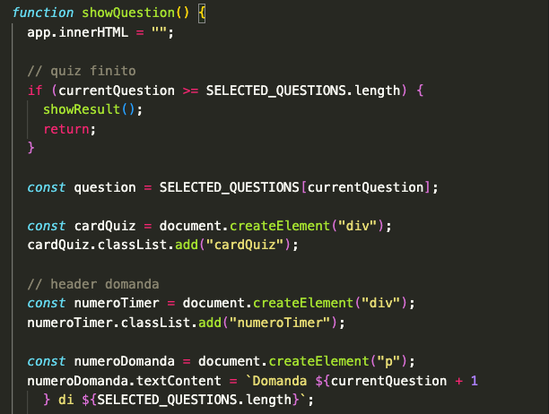
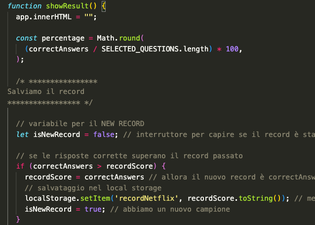
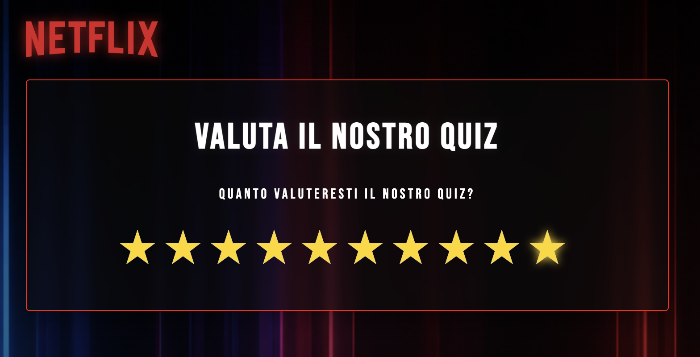

# Netflix Quiz App 🎬

Un quiz interattivo sviluppato in **JavaScript Vanilla** dedicato alle serie TV Netflix più famose.  
L'app genera casualmente 10 domande, gestisce un timer per ogni risposta e mostra un risultato finale con percentuale e valutazione.

Al termine del quiz, l'utente potrà anche lasciare una valutazione dell'esperienza tramite un sistema di feedback dedicato.

Cosa troverai in questo documento:

- [🚀 Funzionalità](#-funzionalità)
- [🛠️ Tecnologie utilizzate](#%EF%B8%8F-tecnologie-utilizzate)
- [📂 Struttura del progetto](#-struttura-del-progetto)
- [🧠 Logica del progetto](#-logica-del-progetto)
- [⏱️ Sistema Timer](#%EF%B8%8F-sistema-timer)
- [📊 Sistema di punteggio](#-sistema-di-punteggio)
- [🎨 SVG Progress Circle](#-svg-progress-circle)
- [▶️ Come avviare il progetto](#%EF%B8%8F-come-avviare-il-progetto)
- [👨‍💻 Team](#%E2%80%8D-team)

---

## 🚀 Funzionalità

- Generazione casuale delle domande
- Timer variabile per ogni domanda
- Risposte mescolate casualmente
- Sistema di punteggio finale
- Stato finale:
  - ✅ PROMOSSO
  - ❌ BOCCIATO
- Barra percentuale circolare realizzata in SVG
- Record personale salvato
- Possibilità di ricominciare il quiz
- Possibilità di scegliere il livello di difficoltà
- Possibilità di scegliere quante domande generare

---

## 🛠️ Tecnologie utilizzate

- HTML5
- CSS3
- JavaScript ES6+

---

## 📂 Struttura del progetto

📁 project  
┣ 📄 index.html  
┣ 📄 style.css  
┣ 📄 script.js  
┣ 📄 questions.json  
┗ 📄 README.md

---

## 🧠 Logica del progetto

L'app segue il pattern:

```Javascript
stato → render → eventi
```

### Stato globale


Gestisce:

- domanda corrente
- timer
- punteggio
- domande selezionate

### Render delle schermate

Funzioni principali:

- **`showWelcome()`**

  

- **`showQuestion()`**

  

- **`showResult()`**

  

### Gestione eventi

Tutti gli eventi vengono gestiti tramite:

```Javascript
addEventListener()
```


---

## ⏱️ Sistema Timer

Ogni domanda ha:

- Secondi disponibili variabili
- Countdown dinamico
- Cambio colore negli ultimi 5 secondi

  

Alla scadenza:

- La risposta viene considerata errata e mostra la risposta corretta in verde

  

- Il quiz passa automaticamente alla domanda successiva

---

## 📊 Sistema di punteggio

Il risultato finale viene calcolato in percentuale:

```Javascript
(correctAnswers / totalQuestions) * 100
```

### Valutazione finale

| Percentuale | Risultato |
| ----------- | --------- |
| ≥ 60%       | PROMOSSO  |
| < 60%       | BOCCIATO  |

---

## 🎨 SVG Progress Circle

Il punteggio finale viene visualizzato tramite un cerchio SVG usando:

```Javascript
strokeDasharray
strokeDashoffset
```


Colori:

- 🟢 Verde → 80%+
- 🟡 Giallo → 60–79%
- 🔴 Rosso → sotto il 60%

---

## ▶️ Come avviare il progetto

1. Clona la repository

```Javascript
git clone https://github.com/tuo-username/netflix-quiz.git
```

2. Apri la cartella del progetto

```Javascript
cd netflix-quiz
```

3. Avvia `index.html` nel browser

---

## 😊 Valutaci! Il tuo feedback è importante



---

## 👨‍💻 Team

Come ci siamo divisi il progetto:

- Claudio
- Simona
- Simone
- Valentina
- Angelo

---

## 📄 Licenza

Progetto realizzato a scopo didattico.
